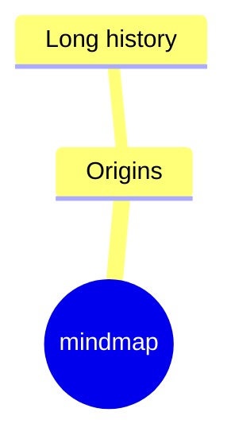

Zrealizowane
* [BAD Canvas Certification](#)
W trakcie
* Akredytowany Coach
* [monthly 1K](https://appsumo.teachable.com/courses/enrolled/333457)
* [Phil Hagspiel](#)
Do zrobienia:
* [Intuiti](https://docs.google.com/document/d/1twsSFT1GmPmpbqf0wb3PZjVCfn3FJUJAKCBSDCvRZYs/edit?usp=sharing)
* [BAD Canvas Course](https://myspace.learningexperience.space/#!/courses/bad-canvas-certification/lessons)
  * [BAD Canvas Course extra](https://miro.com/app/board/uXjVOzcFxdI=/)
  * [mural BAD facilitation](https://app.mural.co/t/cristinalarcher0153/m/cristinalarcher0153/1731685956527/cefa6e1cca4db1d5859e4462154b754e4269824e)
* [Brando](#)
* [Creative ambush](#)
* BAD Digital >> https://sefirot.it/downloads/DIY_BAD.zip
* BADPRO >> https://sefirot.it/downloads/BADPRO-onboarding.pdf

Planowane
* [Hipnoterapia](https://barwyumyslu.pl/szkolenia/omni-hypnosis-training-center/) - 12k
* Behawiorystyka - 12k

* [notion templates](#)

