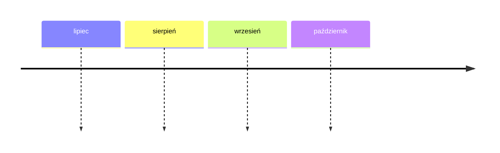

* Bilans miesięczny
	* Lipiec

| Rozchody      | Wartość | Data       |
| ------------- | ------- | ---------- |
| Wynagrodzenie | +21000  | 10.07.2025 |
| Podatki / ZUS | -5000   | 10.07.2025 |
| Czynsz        |         |            |

* Sierpień

Cele:
* Dochód pasywny (2200 / mc)
	* Mieszkanie 1 = 1200 PLN
		* Rocznie = 14000 PLN
	* Mieszkanie 2 = 1000 PLN
		* Remont mieszkania = - 6000 PLN
			* Amortyzacja = 6mcy
			* 1 rok = 6000 PLN
			* 2 rok = 10000 PLN
* Usługi (2000 / mc)
	* Coaching 
		* A Super 
			* 5 klientów / 10 spotkań  / mc @ 150/h = **1500 PLN**
		* B Baza
			* 2 klientów / 4 spotkania / mc @ 120/h = **480 PLN**
		* C Minimum
			* 1 klient / 2 spotkania / mc @ 80/h = **160 PLN**
	* Consulting
	* Warsztaty BAD i Brando
		* A Super
			* 4 warsztaty / mc @ 2500 = **10000 PLN**
		* B Baza
			* 2 warsztaty / mc @ 2000 = **4000 PLN**
		* C Minimum
			* 1 warsztat / mc @ 1000 = **1000 PLN**

* Publikacje
	* Dwa Światy
		* A Super
			* 1040 szt / rok @ 250
			  250 000 PLN 
				  (to tylko 3 sztuki / dzień! 20 szt / tydzień)
		* B Baza
			* 208 szt / rok @ 200
			  40 000 PLN 
				  (1 sztuka / tydzień)
		  * C Minimum
			  * 52 szt / rok @ 160
	* Wiedza

