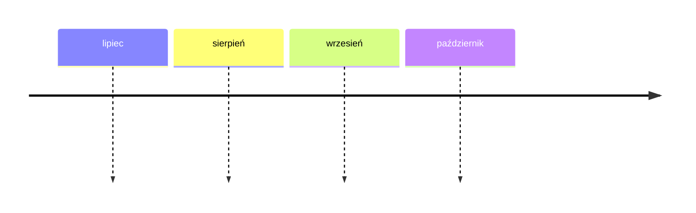

* Bilans miesięczny
	* Lipiec

| Rozchody      | Wartość | Data       |
| ------------- | ------- | ---------- |
| Wynagrodzenie | +21000  | 10.07.2025 |
| Podatki / ZUS | -5000   | 10.07.2025 |
| Czynsz        |         |            |

* Sierpień

Cele:
* Dochód pasywny (2000 / mc)
	* Remont mieszkania
* Usługi (2000 / mc)
	* Coaching 
		* A Super 
			* 5 klientów / 10 spotkań  / mc @ 150/h= 1000 PLN
		* B Baza
			* 2 klientów / 4 spotkania / mc = 400 PLN
		* C Minimum
			* 1 klient / 2 spotkania / mc = 200 PLN
	* Consulting
	* Warsztaty
		* A
			* 4 warsztaty / mc = 
		* B Baza
			* 2 warsztaty / mc = 4000 PLN
		* C Minimum
			* 1 warsztat / mc = 2000 PLN
			* 
* Publikacje
	* Dwa Światy
	* Wiedza

