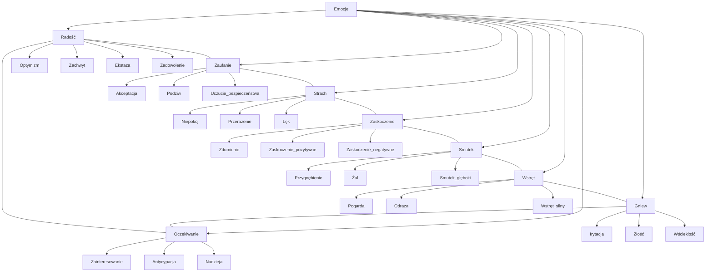

```mermaid
graph TD
    Emocje["Emocje"]
    Radosc["Radość"]
    Zaufanie["Zaufanie"]
    Strach["Strach"]
    Zaskoczenie["Zaskoczenie"]
    Smutek["Smutek"]
    Wstret["Wstręt"]
    Gniew["Gniew"]
    Oczekiwanie["Oczekiwanie"]

    Emocje --> Radosc
    Emocje --> Zaufanie
    Emocje --> Strach
    Emocje --> Zaskoczenie
    Emocje --> Smutek
    Emocje --> Wstret
    Emocje --> Gniew
    Emocje --> Oczekiwanie

    Radosc --> Optymizm
    Radosc --> Zachwyt
    Radosc --> Ekstaza
    Radosc --> Zadowolenie

    Zaufanie --> Akceptacja
    Zaufanie --> Podziw
    Zaufanie --> Uczucie_bezpieczeństwa

    Strach --> Niepokój
    Strach --> Przerażenie
    Strach --> Lęk

    Zaskoczenie --> Zdumienie
    Zaskoczenie --> Zaskoczenie_pozytywne
    Zaskoczenie --> Zaskoczenie_negatywne

    Smutek --> Przygnębienie
    Smutek --> Żal
    Smutek --> Smutek_głęboki

    Wstret --> Pogarda
    Wstret --> Odraza
    Wstret --> Wstręt_silny

    Gniew --> Irytacja
    Gniew --> Złość
    Gniew --> Wściekłość

    Oczekiwanie --> Zainteresowanie
    Oczekiwanie --> Antycypacja
    Oczekiwanie --> Nadzieja

    Radosc---Zaufanie
    Zaufanie---Strach
    Strach---Zaskoczenie
    Zaskoczenie---Smutek
    Smutek---Wstret
    Wstret---Gniew
    Gniew---Oczekiwanie
    Oczekiwanie---Radosc
```
